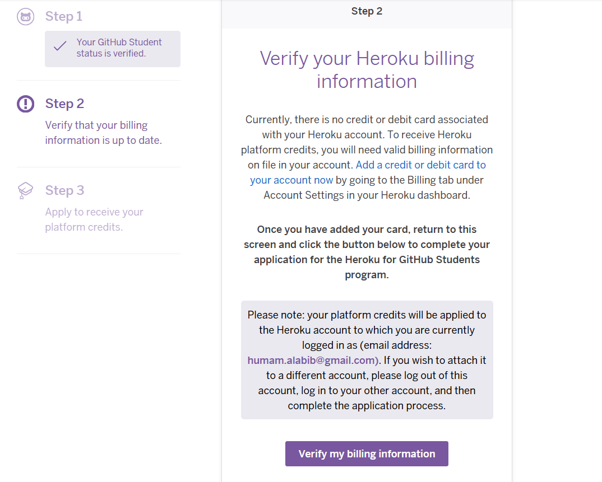

<details>

  <summary>Reflection modul 1</summary>

## Refleksi 1: 

Dokumen ini menjelaskan prinsip clean code dan praktik keamanan yang saya terapkan saat menambahkan fitur "edit product" dan "delete product" pada proyek Spring Boot sederhana ini. Juga berisi temuan kode yang perlu diperbaiki dan saran peningkatan.

## Ringkasan perubahan
- `ProductRepository` : menambahkan metode pencarian (`findById`), pembaruan (`update`) dan penghapusan (`deleteById`).
- `ProductService` dan `ProductServiceImpl` : menambahkan abstraksi/implementasi untuk mencari, memperbarui, menghapus; `create` kini menghasilkan UUID bila `productId` kosong.
- `ProductController` : menambahkan endpoint untuk edit, update, dan delete. Mengganti redirect relatif ke redirect absolut (`redirect:/product/list`) untuk menghindari loop redirect.
- Template Thymeleaf: menambahkan `EditProduct.html`; mengubah `ProductList.html` untuk menampilkan tombol Edit dan Delete; menambahkan konfirmasi JS sederhana pada tombol Delete.

## Clean code principles yang diterapkan
Berikut prinsip-prinsip clean code yang saya terapkan dan di mana mereka muncul di kode:

- Single Responsibility Principle
  - `ProductRepository` hanya bertanggung jawab atas penyimpanan/in-memory CRUD sederhana.
  - `ProductService` mengenkapsulasi logika aplikasi (pemetaan/ID generation, orkestrasi repository).
  - `ProductController` hanya menangani routing dan mempersiapkan model untuk view.

- Separation of Concerns / Layered Architecture
  - Memisahkan controller, service, dan repository sehingga masing-masing lapisan punya tanggung jawab jelas.

- Meaningful Names
  - Nama method dan variabel (misal. `findById`, `deleteById`, `productRepository`) mudah dimengerti.

- Keep methods small and focused
  - Metode di service dan repository kecil dan melakukan satu aksi.

- Defensive programming (parsial)
  - Menambahkan pemeriksaan null sederhana pada repository (`deleteById`, `findById`) untuk menghindari NPE.

- Fail-fast untuk ID generation
  - `create` menghasilkan UUID bila ID kosong sehingga entitas selalu punya identifier untuk operasi selanjutnya.

## Praktik secure coding yang diterapkan
- Hindari infinite redirect loop
  - Mengubah redirect relatif `redirect:list` menjadi `redirect:/product/list` sehingga URL target jelas dan tidak diperlakukan sebagai path relatif yang menyebabkan :id menjadi `list` dan memicu mapping delete lagi.

- Konfirmasi penghapusan di client
  - Menambahkan `onclick="return confirm('Delete this product?');"` untuk mengurangi penghapusan tidak sengaja.

- Output escaping
  - Thymeleaf secara default melakukan escaping untuk ekspresi `${...}` sehingga membantu mencegah XSS pada tampilan.

## Kekurangan / masalah yang ditemukan dan cara memperbaiki
Berikut beberapa kelemahan praktis dari implementasi saat ini dan rekomendasi perbaikan:

1) Delete menggunakan HTTP GET (unsafe)
   - Masalah: Endpoint `GET /product/delete/{id}` melakukan aksi destruktif. Ini melanggar prinsip REST dan memungkinkan CSRF atau link-unintended deletion.
   - Perbaikan: Ubah menjadi POST (atau DELETE) dan gunakan CSRF token yang disediakan Spring Security. Di tampilan, ganti link dengan form kecil:

     <form th:action="@{/product/delete/{id}(id=${product.productId})}" method="post" style="display:inline">
         <input type="hidden" name="_csrf" th:value="${_csrf.token}" />
         <button type="submit" class="btn btn-danger btn-sm" onclick="return confirm('Delete this product?');">Delete</button>
     </form>

   - Dan ubah controller menjadi @PostMapping("/delete/{id}") atau @DeleteMapping.

2) Input validation hilang
   - Masalah: Binding form ke `Product` tanpa validasi dapat menyebabkan exception (misal. field kuantitas kosong -> NumberFormatException) dan data invalid tersimpan.
   - Perbaikan: Tambahkan validasi menggunakan bean validation (Jakarta Validation):
     - Tambahkan anotasi di model: `@NotBlank` pada `productName`, `@Min(0)` pada `productQuantity` (ubah tipe ke `Integer` untuk menangani null input dengan baik).
     - Di controller, terima `@Valid @ModelAttribute Product product, BindingResult result` dan tampilkan kembali form jika ada error.

3) Tipe `int` pada `productQuantity`
   - Masalah: `int` tidak menerima null; saat form dikirim tanpa value akan menimbulkan error parsing.
   - Perbaikan: Gunakan `Integer` untuk menerima null dan lakukan validasi eksplisit.

4) Thread-safety dan concurrency
   - Masalah: `ProductRepository` menggunakan `ArrayList` non-sinkron; bila aplikasi berjalan multi-threaded (server nyata) bisa terjadi kondisi race saat create/update/delete.
   - Perbaikan: Gunakan `CopyOnWriteArrayList`, `Collections.synchronizedList(...)`, atau lebih baik gunakan database (H2, PostgreSQL, dsb.) untuk persistence.

5) Tidak ada logging dan error handling
   - Masalah: Kegagalan atau kondisi edge tidak dilaporkan.
   - Perbaikan: Tambahkan logging (SLF4J) pada service/controller/repository dan gunakan mekanisme exception handler (ControllerAdvice) untuk menampilkan pesan kesalahan yang ramah pengguna.

6) Tidak ada unit/integration tests
   - Perbaikan: Tambahkan unit tests untuk service/repository dan integrasi MVC tests untuk controller (MockMvc) untuk menjamin perilaku CRUD.

7) Potential XSS and output encoding
   - Keterangan: Thymeleaf melakukan escaping default, namun bila ada `th:utext` atau output yang tidak di-escape, perlu diwaspadai.

8) No authentication/authorization
   - Saran: Jika aplikasi akan digunakan nyata, tambahkan Spring Security dan batasi akses ke operasi create/edit/delete.

## Rekomendasi refactor kecil (contoh)
- Ubah `Product.productQuantity` menjadi `Integer` dan tambahkan validasi:

```java
@NotBlank
private String productName;
@NotNull
@Min(0)
private Integer productQuantity;
```

- Ubah delete menjadi POST seperti dijelaskan di atas.
- Tambahkan `BindingResult` handling pada controller untuk create/update.
- Tambahkan logging statements, contoh: `private static final Logger log = LoggerFactory.getLogger(ProductServiceImpl.class);` dan log pada operasi penting.

## Keamanan tambahan bila di-deploy nyata
- Aktifkan HTTPS
- Gunakan CSRF protection dan method POST/DELETE untuk operasi destruktif
- Validasi dan sanitasi semua input
- Batasi ukuran input dan rate-limit bila perlu

## Penutup
Secara umum, perubahan-perubahan yang dilakukan mengikuti pola layer-service-repository dan prinsip clean-code dasar. Namun implementasi ini masih minimal (in-memory, tidak ada validasi, tidak ada proteksi autentikasi/otorisasi). Untuk produksi, langkah-langkah perbaikan yang saya sebutkan harus diterapkan.

## Refleksi 2

1) Perasaan setelah menulis unit test, dan berapa banyak unit test yang perlu dibuat

- Perasaan: Menulis unit test terasa membantu karena memaksa saya menjelaskan dan mengunci perilaku yang diharapkan dari modul (misal. update/delete pada repository). Unit test membuat regresi terlihat lebih cepat dan meningkatkan kepercayaan saat refactor.
- Berapa banyak test per kelas: tidak ada angka pasti. Fokusnya adalah kualitas, bukan kuantitas. Sikap yang baik:
  - Tulis test untuk jalur utama (happy path).
  - Tambahkan test untuk edge cases (misal. null, input invalid, boundary values).
  - Tambahkan test untuk jalur error/eksepsi dan kasus non-eksistensi.
  - Untuk tiap public method, ada 1..N test yang memverifikasi perilaku penting; biasanya 3	6 test per metode yang non-trivial.

- Bagaimana memastikan unit tests cukup:
  - Gunakan pendekatan berbasis risiko: uji bagian kode yang paling kritis dan rentan kesalahan lebih lengkap.
  - Gunakan code coverage sebagai metrik untuk melihat area yang belum diuji, tapi jangan jadikan angka (misal. 100%) sebagai satu-satunya tujuan.
  - Terapkan mutation testing (tools seperti PIT) untuk memastikan test benar-benar menangkap perubahan perilaku.
  - Pastikan tests memverifikasi behavior (kontrak publik), bukan implementation details.

- Tentang code coverage: ini berguna untuk mengetahui garis batas area yang belum diuji. Tetapi 100% coverage tidak berarti kode bebas bug: coverage hanya menunjukkan bahwa baris/branch dijalankan oleh test, bukan bahwa semua kombinasi input, kondisi rasio, concurrency, atau integrasi eksternal telah diuji.

2) Duplikasi pada functional test suites dan kualitas kode

- Situasi: Anda membuat kelas functional test baru yang menyalin setup dan variabel dari test sebelumnya. Ini cepat, tapi menimbulkan duplikasi.

- Potensi masalah clean code:
  - Violation of DRY: banyak setup yang identik di banyak kelas membuat perubahan pada setup harus diulang di banyak tempat.
  - Maintainability: saat konfigurasi berubah (misal. baseUrl, port handling, WebDriver options), Anda harus mengubah banyak file.
  - Readability: panjang file dengan boilerplate setup menyembunyikan intent test.
  - Test fragility: duplikasi pengaturan waktu/wait/driver options bisa menyebabkan flakiness yang sulit ditangani di satu tempat.

- Rekomendasi perbaikan (cara membuat kode lebih bersih):
  1. Extract shared setup into a base test class
    - Buat `AbstractSeleniumTest` yang mengandung `@LocalServerPort`, `@Value`, `@BeforeEach` setup, dan helper seperti `getBaseUrl()`.
    - Semua functional test extends class ini -> mengurangi duplikasi.

  2. Use Page Object Pattern
    - Buat class page object untuk halaman (CreateProductPage, ProductListPage) yang membungkus locator dan aksi (fillName, fillQuantity, submit, getTableRows).
    - Test menjadi: open page, page.fillName(...), page.submit(), assert pageList.contains(...)
    - Ini membuat tests lebih deklaratif dan lebih mudah dipelihara saat UI berubah.

  3. Centralize WebDriver configuration
    - Jika menggunakan SeleniumJupiter atau WebDriverManager, buat helper untuk ChromeOptions (headless, timeouts) agar konsisten.

  4. Parameterize or reuse tests where possible
    - Jika Anda ingin memeriksa beberapa data input, gunakan `@ParameterizedTest` atau loop data-driven testing alih-alih menyalin kelas test.

  5. Separate unit tests and functional tests
    - Simpan functional tests di source set atau task yang terpisah (`functionalTest`) sehingga CI dapat menjalankannya terpisah dari unit tests.

- Contoh struktur base test (singkat):

```java
@SpringBootTest(webEnvironment = RANDOM_PORT)
@ExtendWith(SeleniumJupiter.class)
public abstract class AbstractSeleniumTest {
   @LocalServerPort
   protected int serverPort;

   @Value("${app.baseUrl:http://localhost}")
   protected String testBaseUrl;

   protected String baseUrl() {
      return String.format("%s:%d", testBaseUrl, serverPort);
   }
}
```

Kemudian `CreateProductFunctionalTest` hanya fokus pada langkah user actions, tidak lagi boilerplate konfigurasi.

Kesimpulan singkat:
- Unit tests membuat saya merasa lebih percaya saat mengubah kode, tapi harus ditulis cerdas (happy path + edge cases). Code coverage membantu tetapi bukan bukti bebas bug.
- Untuk functional tests, hindari duplikasi: gunakan base class, page objects, dan central configuration agar kode test tetap bersih, mudah dipelihara, dan tahan terhadap perubahan UI.
</details>

<details>

  <summary>Reflection modul 2</summary>
</details>

<details>

  <summary>Reflection modul 2</summary>

## Refleksi Modul 2

1) Code quality issue(s) yang saya perbaiki selama exercise dan strategi perbaikannya

- Dependency / test engine mismatch
  - Masalah: Build/test gagal karena versi JUnit/JUnit Platform dan dependensi pengujian (Selenium/Jupiter) tidak selaras, menyebabkan NoSuchMethodError dan kegagalan runtime pada pipeline.
  - Strategi: Kembalikan ke versi yang dikelola oleh Spring Boot BOM (hilangkan override versi eksplisit), hapus dependensi redundan dari classpath unit-test yang menyebabkan konflik, dan jalankan ulang gradle test untuk memverifikasi perbaikan. Hasil: test engine selaras kembali dan runtime error hilang.

- Thymeleaf template resolution (case-sensitive filenames)
  - Masalah: @WebMvcTest gagal merender view dengan TemplateInputException karena nama file template tidak cocok (perbedaan kapitalisasi pada file `CreateProduct.html` / `createProduct.html`). Pada CI (Linux runner) filesystem case-sensitive memperparah masalah.
  - Strategi: Perbaiki root cause dengan menyamakan nama view dan file template (rename ke lowercase sesuai view names), dan tambahkan import `ThymeleafAutoConfiguration` pada test slice agar view dapat dirender selama @WebMvcTest. Verifikasi dengan menjalankan controller tests.

- Redirect loop / unsafe HTTP method for destructive action
  - Masalah: `redirect:list` relative redirect menyebabkan loop pada beberapa kondisi; endpoint delete awalnya menggunakan GET yang tidak sesuai praktik REST.
  - Strategi: Ubah redirect menjadi absolut `redirect:/product/list` untuk menghindari ambiguitas. Untuk delete, rekomendasi diterapkan — ubah ke POST/DELETE dan gunakan form dengan CSRF token; sementara itu tambahkan konfirmasi JS untuk mengurangi accidental deletes.

- Missing/empty Sonar args and missing SONAR_TOKEN secret in workflow
  - Masalah: SonarCloud action menjalankan container tanpa token atau dengan argumen kosong `-Dsonar.projectKey=` yang menyebabkan error pesan "Set the SONAR_TOKEN env variable." atau analisis kosong.
  - Strategi: Update workflow untuk fail-fast jika `secrets.SONAR_TOKEN` kosong dan baca `sonar.projectKey` / `sonar.organization` dari repository secrets (`SONAR_PROJECT_KEY`, `SONAR_ORGANIZATION`). Berikan instruksi jelas pada README untuk menambahkan secrets.

- Tests / coverage gaps
  - Masalah: Tidak ada atau sedikit unit tests awalnya; beberapa behavior controller tidak tervalidasi.
  - Strategi: Tambah unit tests untuk repository/service, dan MockMvc tests untuk controller. Jalankan test suite dan gunakan JaCoCo untuk melihat area yang kurang diuji; gunakan hasil tersebut untuk menambah test yang menargetkan jalur utama dan edge cases.

Ringkasnya, strategi perbaikan saya selalu mengikuti pola: (1) reproduksi masalah secara lokal/CI, (2) analisis root-cause (logs, stack traces, file diffs), (3) buat perubahan kecil dan terfokus yang memecahkan akar masalah, (4) tambahkan test/verifikasi dan jalankan pipeline, (5) dokumentasikan perubahan dan langkah lanjutan.

2) Apakah implementasi CI/CD saat ini memenuhi definisi Continuous Integration dan Continuous Deployment?

Pendapat singkat: Secara fungsional pipeline mendekati prinsip Continuous Integration, dan ada langkah analisis kualitas otomatis; untuk Continuous Deployment, perlu beberapa perbaikan agar aman dan andal.

- Continuous Integration (CI): Ya, sebagian besar terpenuhi. Workflow dijalankan pada push/pull_request dan melakukan build, menjalankan test-suite otomatis, dan melakukan analisis kode (SonarCloud). Ini mewujudkan integrasi berkala, umpan balik cepat atas regressions, dan pemeriksaan kualitas.

- Continuous Deployment (CD): Belum sepenuhnya. Jika ada job deploy otomatis ke PaaS, itu memenuhi aspek otomatisasi, namun untuk menjadi CD yang matang kita butuh: lingkungan staging/production terpisah, promosi terkontrol (approval atau gating), rollback strategy, dan deployment-safe checks (mis. test coverage threshold, smoke tests, health checks) — beberapa hal ini belum diimplementasikan atau belum sepenuhnya otomatis/divalidasi di workflow saat ini.

Alasan singkat (3+ kalimat): Workflow saat ini mengotomatiskan build, test, dan quality scan pada setiap commit/PR sehingga memenuhi inti CI. Namun deployment otomatis tanpa proteksi (misalnya tanpa gating, tanpa secrets/rollbacks, tanpa environment promotion) berisiko; sehingga CD-nya masih perlu penambahan keamanan dan kebijakan. Untuk benar-benar mencapai Continuous Deployment yang matang, saya sarankan menambahkan job deployment yang hanya berjalan ketika branch tertentu (mis. main) lulus serangkaian checks, menambahkan manual approval untuk production, dan menyiapkan monitoring/rollback otomatis.

Rekomendasi perbaikan CI/CD singkat:
- Tambahkan gating pada PR: jalankan unit + integration + smoke tests, dan hanya izinkan merge bila status sukses.
- Pisahkan functional tests (Selenium) ke job tersendiri atau ke stage yang berjalan setelah build dan unit tests lulus; jalankan headless di CI dengan WebDriverManager atau gunakan testcontainers untuk environment yang stabil.
- Tambahkan deployment pipeline yang mempromosikan artifact ke staging lalu produksi; gunakan approvals, health checks, dan otomatis rollback bila health check gagal.
- Tambahkan metric/alerting (sentry, prometheus) dan integrasi deploy-notifications.

--

Saya sudah mencoba untuk deploy tetapi masih butuh kartu kredit jadi tidak bisa



</details>

</details>